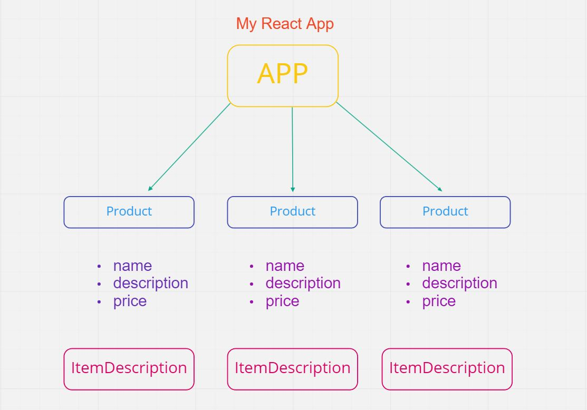

# React-Fundamental-Crash-Course

### Components

- Are a part of the User Interface
- There are Functional and Class components 
- Components allow to re-use your code efficient 
- Facebook for instance have a very large component library they can rely on. 

Here a schema example of a React App with different components, we will use this schema in Props,States further in this crash course.




### Props - Properties

- Props are used to pass in data into our components
- Can both be used in functional and class components
- Props always go from top level downwards

In this example we make a functional component Product with 3 normal properties or destructured props.
```js
function Product (props) or ({name, description, price}){
    return (
        <div>
            <h1>{props.name} or {name}</h1>
            <h1>{props.description} or {description}</h1>
            <h1>{props.price} or {price}</h1>
        </div>
    );
}
export default Product;
```
Now we need to render this:
```js
function App () {
    return (
        <div>
            <Product
                name="Amazon"
                descripton="Cube Digital Clock"
                price={59.99}
            />
            <Product
                name="Google"
                descripton="Assistant"
                price={109.99}
            />
            
        </div>
    )
}
```
We could now make another component under this Product called ItemDescription: (we will only use the name and description)
```js
function ItemDescription ({name, description}){
    return (
        <div>
            <p>{name}</p>
            <p>{description}</p>
        </div>
    );
}
export default ItemDescription;
```
In the Parent Product we can now change the return: 
```js
function Product ({name, description, price}){
    return (
        <div>
            <ItemDescription name={name} description={description}/>
            <h3>{price}</h3>
        </div>
    );
}
export default Product;
```
So now when we render this to the screen, the name and description will be in a p tag and the price will be in h3.
In Class components we need to use the this. keyword and this.state in order to get access to our props.
